## TDR链路测试项目

### 测试项
| 测试类别 | 测试编号 | 测试名称 | 测试配置说明 |
|---------|---------|---------|-------------|
| **TDR板卡直连测试 - 差分** | 1.1 | 差分直连 | 左右板卡P-P、N-N直连 |
|  | 1.2 | 差分直连+10dB衰减器 | 直连链路中增加10dB衰减器 |
|  | 1.3 | 差分直连+延长接头x1 | P线增加1个延长接头 |
|  | 1.4 | 差分直连+延长接头x2 | P线增加2个延长接头 |
|  | 1.5 | 差分交叉 | 左右板卡P-N、N-P交叉连接 |
|  | 1.6 | 差分交叉+10dB衰减器 | 交叉链路中增加10dB衰减器 |
| **TDR板卡直连测试 - 单端** | 2.1 | P-P单端测试 | P-P连接，其余端口接50Ω负载 |
|  | 2.2 | P-N单端测试 | P-N连接，其余端口接50Ω负载 |
|  | 2.3 | N-P单端测试 | N-P连接，其余端口接50Ω负载 |
|  | 2.4 | N-N单端测试 | N-N连接，其余端口接50Ω负载 |
| **标准传输线测试 - 差分** | 3.1 | 传输线差分直连 | 通过100Ω差分线直连(P-P/N-N) |
|  | 3.2 | 传输线差分交叉 | 通过100Ω差分线交叉连接(P-N/N-P) |
| **标准传输线测试 - 单端** | 4.1 | S21测试 | P1→P2传输，其他端口接负载 |
|  | 4.2 | S41测试 | P1→P4传输，其他端口接负载 |
|  | 4.3 | S23测试 | P3→P2传输，其他端口接负载 |
|  | 4.4 | S43测试 | P3→P4传输，其他端口接负载 |
| **DUT传输线测试 - 差分** | 5.1 | 传输线差分直连 | 通过100Ω差分线直连(P-P/N-N) |
|  | 5.2 | 传输线差分交叉 | 通过100Ω差分线交叉连接(P-N/N-P) |
| **DUT传输线测试 - 单端** | 6.1 | S21测试 | P1→P2传输，其他端口接负载 |
|  | 6.2 | S41测试 | P1→P4传输，其他端口接负载 |
|  | 6.3 | S23测试 | P3→P2传输，其他端口接负载 |
|  | 6.4 | S43测试 | P3→P4传输，其他端口接负载 |

### 1、TDR板卡直连测试
#### 差分测试项目
1. 差分直连
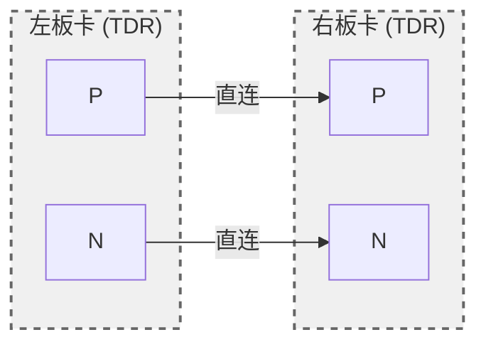
2. 差分直连+10db衰减器
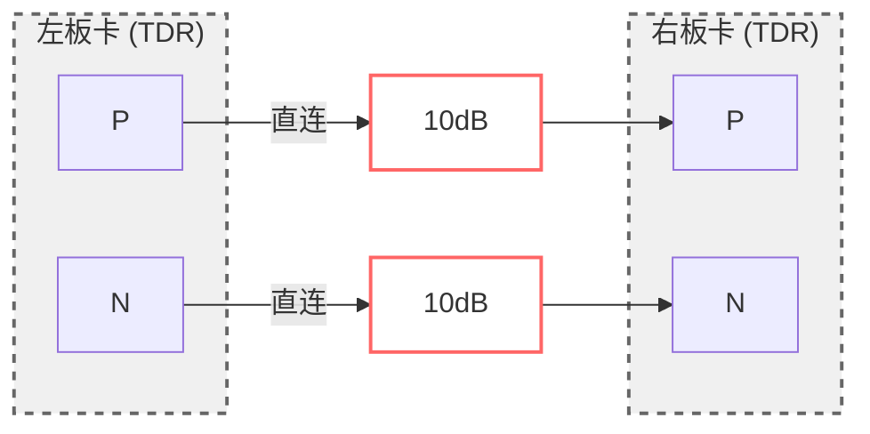
3. 差分直连+延长接头x1
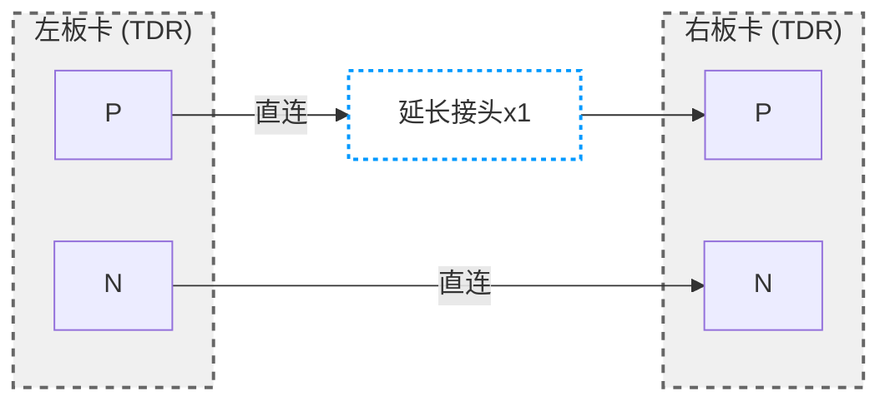
3. 差分直连+延长接头X2

4. 差分交叉
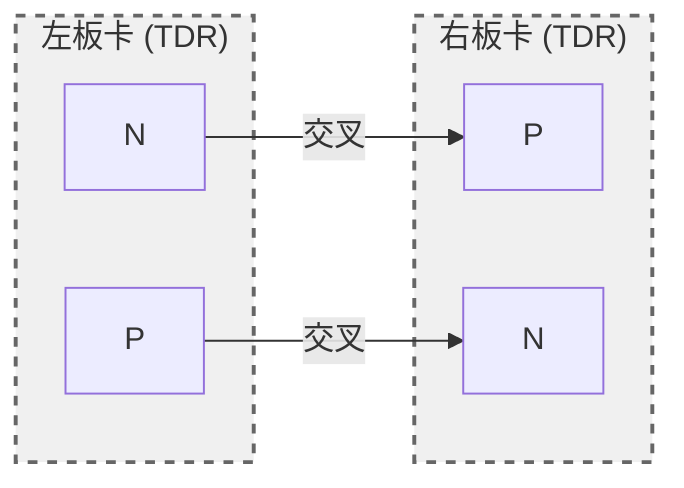
5. 差分交叉+10db衰减器
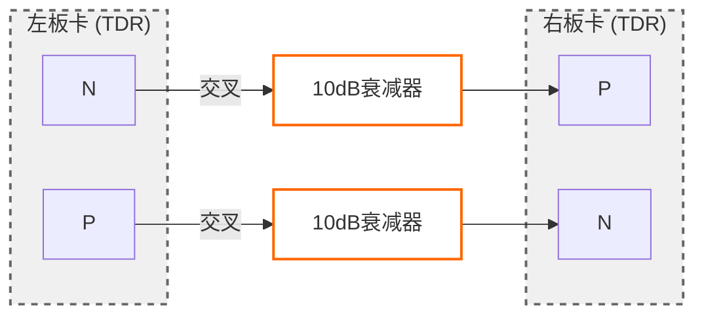
#### 单端测试项目
1. P接P测试，其余接负载
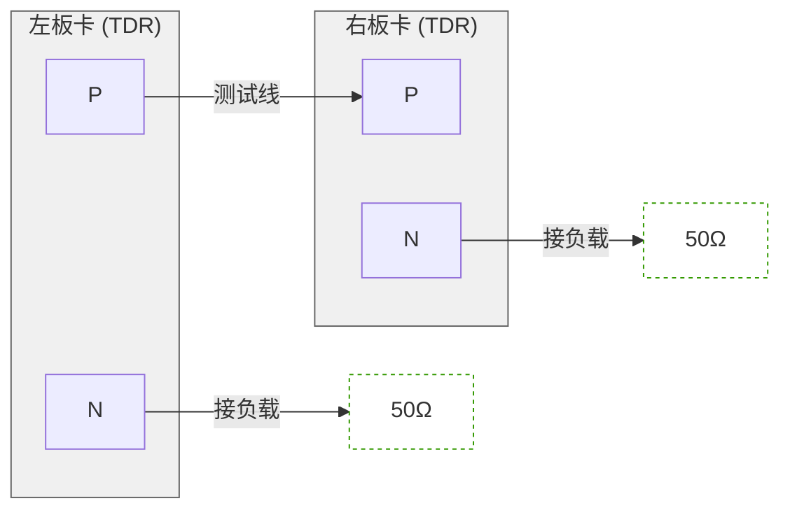
2. P接N测试，其余接负载

3. N接P测试，其余接负载

4. N接N测试，其余接负载
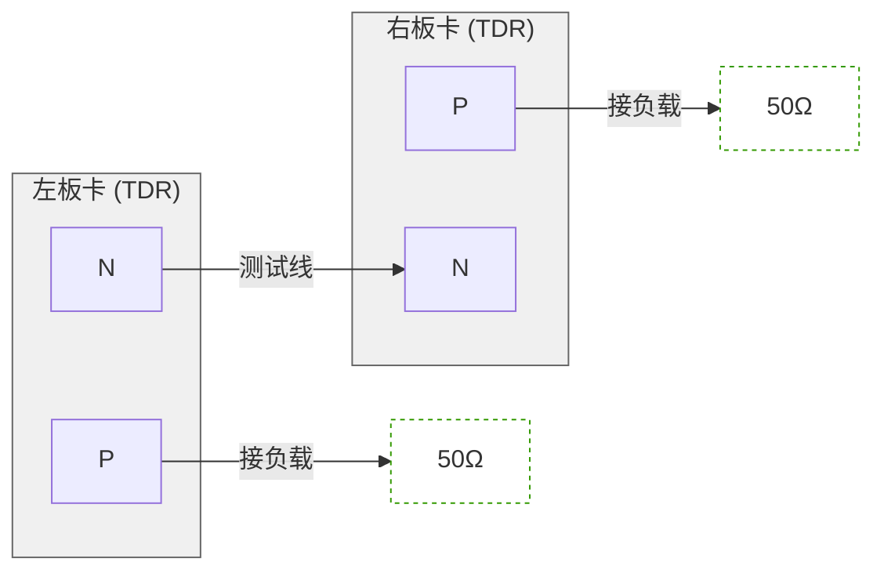
### 1、TDR板卡标准传输线测试
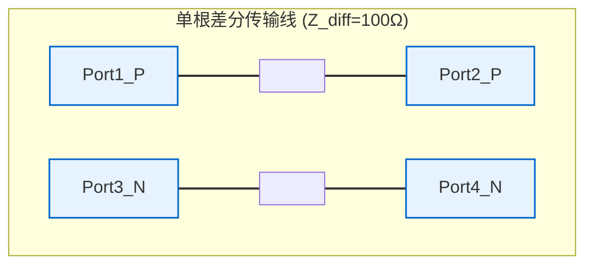
#### 差分测试项目
1. 差分直连
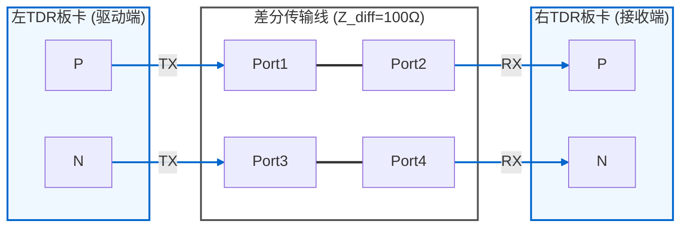
2. 差分交叉
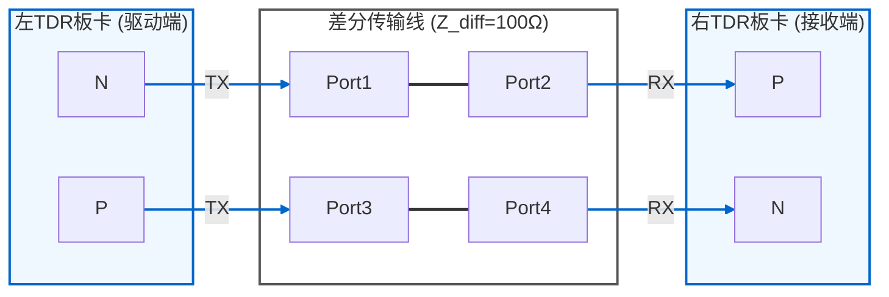
#### 单端测试项目
1. S21
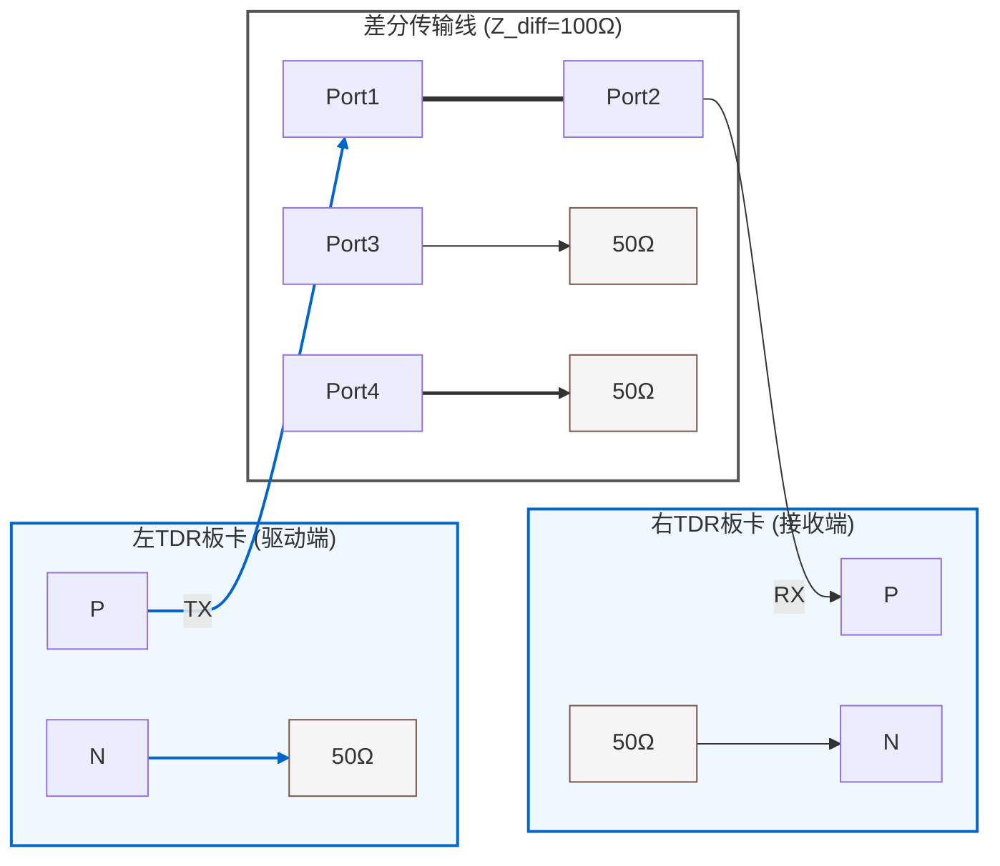
2. S41

3. S23
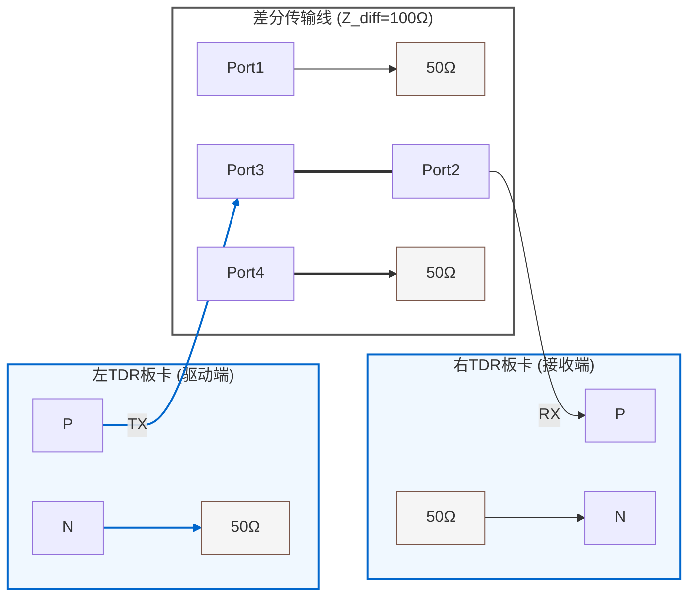
4. S43
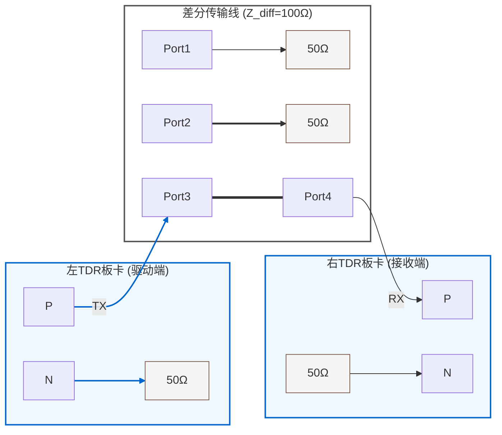
### 1、TDR板卡PCIE DUT测试
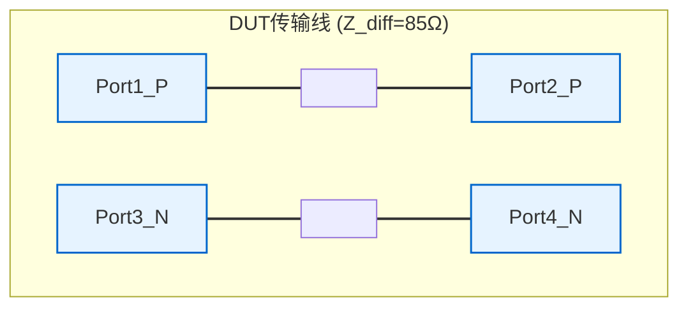
#### 差分测试项目
1. 差分直连
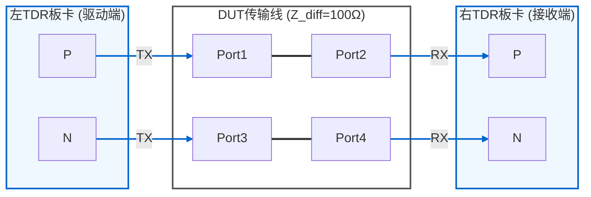
2. 差分交叉
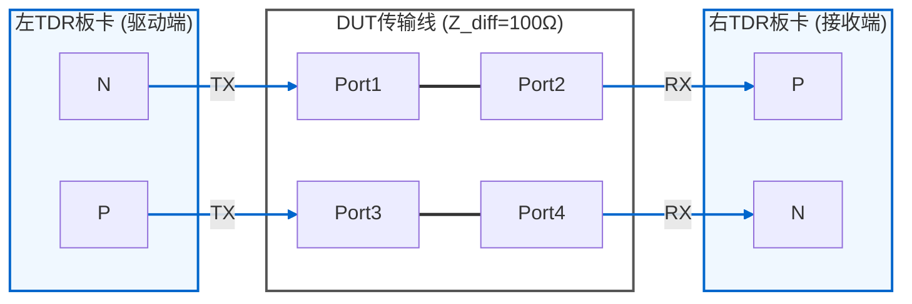
#### 单端测试项目
1. S21
```mermaid
graph LR
    %% ========== 1. 区域框架定义 ==========
    subgraph LEFT["左TDR板卡 (驱动端)"]
        L_P[P] 
        L_N[N] --> LOAD_L["50Ω"]
    end

    subgraph 差分线["DUT传输线 (Z_diff=100Ω)"]
        TL_P[Port1]
        IN_P[Port2]
        TL_N[Port3] --> LOAD_TL["50Ω"]
        IN_N[Port4] --> LOAD_IN["50Ω"]
    end

    subgraph RIGHT["右TDR板卡 (接收端)"]
        R_P[P]
        LOAD_R["50Ω"]  --> R_N[N]
    end

    %% ========== 2. 有效信号连接 ==========
    L_P -->|TX| TL_P
    TL_P === IN_P
    IN_P -->|RX| R_P
 

    %% ========== 3. 样式定义 ==========
    class LEFT,RIGHT tdrStyle
    class 差分线 lineStyle
    classDef tdrStyle fill:#f0f8ff,stroke:#0066cc,stroke-width:2px
    classDef lineStyle fill:none,stroke:#555,stroke-width:2px
    classDef loadStyle fill:#f5f5f5,stroke:#795548,stroke-width:1px
    
    %% 负载样式特殊标记
    class LOAD_L,LOAD_TL,LOAD_IN,LOAD_R loadStyle
    
    %% 连线样式（注释必须单独成行）
    linkStyle 0 stroke:#0066cc,stroke-width:2px
    %% P线保持蓝色
    
    linkStyle 2 stroke:#333,stroke-width:2.5px
    %% 传输线
    
    linkStyle 4 stroke:#0066cc,stroke-width:2px
    %% P线
```
2. S41
```mermaid
graph LR
    %% ========== 1. 区域框架定义 ==========
    subgraph LEFT["左TDR板卡 (驱动端)"]
        L_P[P] 
        L_N[N] --> LOAD_L["50Ω"]
    end

    subgraph 差分线["DUT传输线 (Z_diff=100Ω)"]
        TL_P[Port1]
        IN_P[Port2] --> LOAD_TL["50Ω"]
        TL_N[Port3] --> LOAD_IN["50Ω"]
        IN_N[Port4] 
    end

    subgraph RIGHT["右TDR板卡 (接收端)"]
        R_P[P]
        LOAD_R["50Ω"]  --> R_N[N]
    end

    %% ========== 2. 有效信号连接 ==========
    L_P -->|TX| TL_P
    TL_P === IN_N
    IN_N -->|RX| R_P
 

    %% ========== 3. 样式定义 ==========
    class LEFT,RIGHT tdrStyle
    class 差分线 lineStyle
    classDef tdrStyle fill:#f0f8ff,stroke:#0066cc,stroke-width:2px
    classDef lineStyle fill:none,stroke:#555,stroke-width:2px
    classDef loadStyle fill:#f5f5f5,stroke:#795548,stroke-width:1px
    
    %% 负载样式特殊标记
    class LOAD_L,LOAD_TL,LOAD_IN,LOAD_R loadStyle
    
    %% 连线样式（注释必须单独成行）
    linkStyle 0 stroke:#0066cc,stroke-width:2px
    %% P线保持蓝色
    
    linkStyle 2 stroke:#333,stroke-width:2.5px
    %% 传输线
    
    linkStyle 4 stroke:#0066cc,stroke-width:2px
    %% P线
```
3. S23
```mermaid
graph LR
    %% ========== 1. 区域框架定义 ==========
    subgraph LEFT["左TDR板卡 (驱动端)"]
        L_P[P] 
        L_N[N] --> LOAD_L["50Ω"]
    end

    subgraph 差分线["DUT传输线 (Z_diff=100Ω)"]
        TL_P[Port1] --> LOAD_TL["50Ω"]
        IN_P[Port2]
        TL_N[Port3]
        IN_N[Port4] --> LOAD_IN["50Ω"]
    end

    subgraph RIGHT["右TDR板卡 (接收端)"]
        R_P[P]
        LOAD_R["50Ω"]  --> R_N[N]
    end

    %% ========== 2. 有效信号连接 ==========
    L_P -->|TX| TL_N
    TL_N === IN_P
    IN_P -->|RX| R_P
 

    %% ========== 3. 样式定义 ==========
    class LEFT,RIGHT tdrStyle
    class 差分线 lineStyle
    classDef tdrStyle fill:#f0f8ff,stroke:#0066cc,stroke-width:2px
    classDef lineStyle fill:none,stroke:#555,stroke-width:2px
    classDef loadStyle fill:#f5f5f5,stroke:#795548,stroke-width:1px
    
    %% 负载样式特殊标记
    class LOAD_L,LOAD_TL,LOAD_IN,LOAD_R loadStyle
    
    %% 连线样式（注释必须单独成行）
    linkStyle 0 stroke:#0066cc,stroke-width:2px
    %% P线保持蓝色
    
    linkStyle 2 stroke:#333,stroke-width:2.5px
    %% 传输线
    
    linkStyle 4 stroke:#0066cc,stroke-width:2px
    %% P线
```
4. S43
```mermaid
graph LR
    %% ========== 1. 区域框架定义 ==========
    subgraph LEFT["左TDR板卡 (驱动端)"]
        L_P[P] 
        L_N[N] --> LOAD_L["50Ω"]
    end

    subgraph 差分线["DUT传输线 (Z_diff=100Ω)"]
        TL_P[Port1] --> LOAD_TL["50Ω"]
        IN_P[Port2] --> LOAD_IN["50Ω"]
        TL_N[Port3]
        IN_N[Port4]
    end

    subgraph RIGHT["右TDR板卡 (接收端)"]
        R_P[P]
        LOAD_R["50Ω"]  --> R_N[N]
    end

    %% ========== 2. 有效信号连接 ==========
    L_P -->|TX| TL_N
    TL_N === IN_N
    IN_N -->|RX| R_P
 

    %% ========== 3. 样式定义 ==========
    class LEFT,RIGHT tdrStyle
    class 差分线 lineStyle
    classDef tdrStyle fill:#f0f8ff,stroke:#0066cc,stroke-width:2px
    classDef lineStyle fill:none,stroke:#555,stroke-width:2px
    classDef loadStyle fill:#f5f5f5,stroke:#795548,stroke-width:1px
    
    %% 负载样式特殊标记
    class LOAD_L,LOAD_TL,LOAD_IN,LOAD_R loadStyle
    
    %% 连线样式（注释必须单独成行）
    linkStyle 0 stroke:#0066cc,stroke-width:2px
    %% P线保持蓝色
    
    linkStyle 2 stroke:#333,stroke-width:2.5px
    %% 传输线
    
    linkStyle 4 stroke:#0066cc,stroke-width:2px
    %% P线
```


```mermaid
graph LR
    %% ========== 1. 系统框架定义 ==========
    subgraph DRIVER["驱动端板卡"]
        D_P[TX+]
        D_N[TX-]
    end

    subgraph DUT["被测设备(DUT)"]
        DUT_P1[Port1]
        DUT_P2[Port2]
        DUT_P3[Port3]
        DUT_P4[Port4]
    end

    subgraph RECEIVER["接收端板卡"]
        R_P[RX+]
        R_N[RX-]
    end

    %% ========== 2. 独立终端负载配置 ==========
    %% 驱动端正极负载
    D_LOAD_P1["DP_LOAD1(50Ω)"]:::driver_load_p
    D_LOAD_P2["DP_LOAD2(50Ω)"]:::driver_load_p
    
    %% 驱动端负极负载
    D_LOAD_N1["DN_LOAD1(50Ω)"]:::driver_load_n
    D_LOAD_N2["DN_LOAD2(50Ω)"]:::driver_load_n
    
    %% 接收端正极负载
    R_LOAD_P1["RP_LOAD1(50Ω)"]:::receiver_load_p
    R_LOAD_P2["RP_LOAD2(50Ω)"]:::receiver_load_p
    
    %% 接收端负极负载
    R_LOAD_N1["RN_LOAD1(50Ω)"]:::receiver_load_n
    R_LOAD_N2["RN_LOAD2(50Ω)"]:::receiver_load_n

    %% ========== 3. 信号路径连接 ==========
    %% 驱动端正极路径
    D_P --> D_LOAD_P1 --> D_LOAD_P2 --> DUT_P1
    
    %% 驱动端负极路径
    D_N --> D_LOAD_N1 --> D_LOAD_N2 --> DUT_P3

    %% DUT内部差分线
    DUT_P1 === DUT_P2  
    DUT_P3 === DUT_P4 

    %% 接收端正极路径
    DUT_P2 --> R_LOAD_P1 --> R_LOAD_P2 --> R_P
    
    %% 接收端负极路径
    DUT_P4 --> R_LOAD_N1 --> R_LOAD_N2 --> R_N

    %% ========== 4. 样式定义 ==========
    class DRIVER,RECEIVER cardStyle
    class DUT dutStyle
    
    %% 板卡样式
    classDef cardStyle fill:#e6f3ff,stroke:#3399ff,stroke-width:2px
    
    %% DUT样式
    classDef dutStyle fill:#f9f9f9,stroke:#666,stroke-width:2px,stroke-dasharray:5,3
    
    %% 驱动端负载样式
    classDef driver_load_p fill:#d4ebff,stroke:#0066cc,stroke-width:1.8px
    classDef driver_load_n fill:#e6f7ff,stroke:#0099ff,stroke-width:1.8px
    
    %% 接收端负载样式
    classDef receiver_load_p fill:#ffdddd,stroke:#ff3333,stroke-width:1.8px
    classDef receiver_load_n fill:#ffeeee,stroke:#ff6666,stroke-width:1.8px
    
    %% ========== 5. 单线样式配置 ==========
    %% 驱动端正极线(蓝色系)
    linkStyle 0 stroke:#003366,stroke-width:2.2px  
    %% D_P→DP_LOAD1
    linkStyle 1 stroke:#336699,stroke-width:2.0px  
    %% DP_LOAD1→DP_LOAD2
    linkStyle 2 stroke:#6699cc,stroke-width:1.8px  
    %% DP_LOAD2→DUT_P1
    
    %% 驱动端负极线(浅蓝系)
    linkStyle 3 stroke:#0088cc,stroke-width:2.2px  
    %% D_N→DN_LOAD1
    linkStyle 4 stroke:#00aaff,stroke-width:2.0px  
    %% DN_LOAD1→DN_LOAD2
    linkStyle 5 stroke:#33ccff,stroke-width:1.8px  
    %% DN_LOAD2→DUT_P3
    
    %% 差分线(黑灰渐变)
    linkStyle 6 stroke:#000000,stroke-width:3.5px  
    %% DUT_P1→DUT_P2
    linkStyle 7 stroke:#444444,stroke-width:3.5px  
    %% DUT_P3→DUT_P4
    
    %% 接收端正极线(红色系)
    linkStyle 8 stroke:#cc0000,stroke-width:2.2px  
    %% DUT_P2→RP_LOAD1
    linkStyle 9 stroke:#ff3333,stroke-width:2.0px  
    %% RP_LOAD1→RP_LOAD2
    linkStyle 10 stroke:#ff6666,stroke-width:1.8px 
    %% RP_LOAD2→R_P
    
    %% 接收端负极线(粉红系)
    linkStyle 11 stroke:#ff9999,stroke-width:2.2px  
    %% DUT_P4→RN_LOAD1
    linkStyle 12 stroke:#ffbbbb,stroke-width:2.0px  
    %% RN_LOAD1→RN_LOAD2
    linkStyle 13 stroke:#ffdddd,stroke-width:1.8px  
    %% RN_LOAD2→R_N
      
```  

