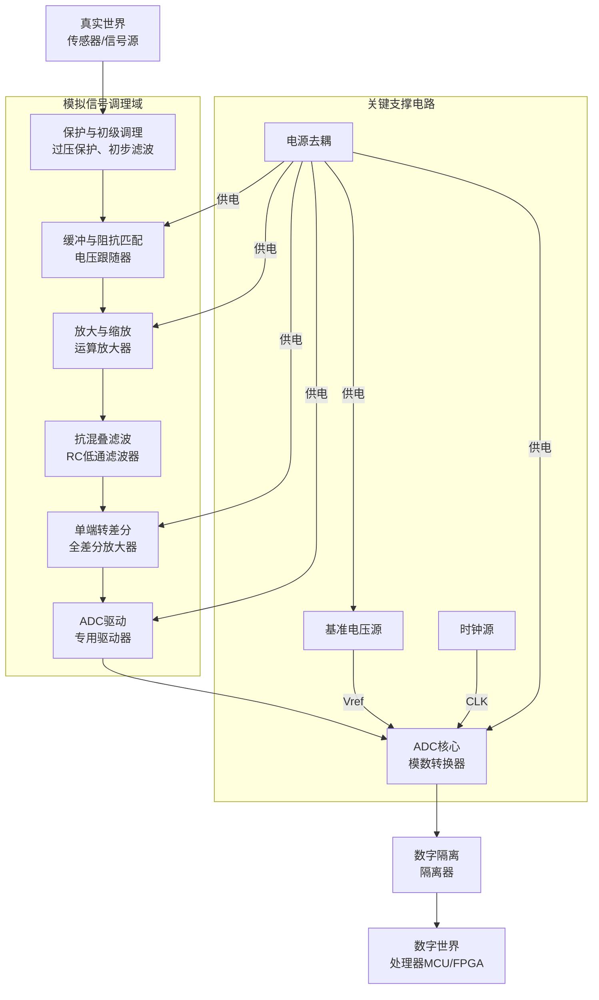
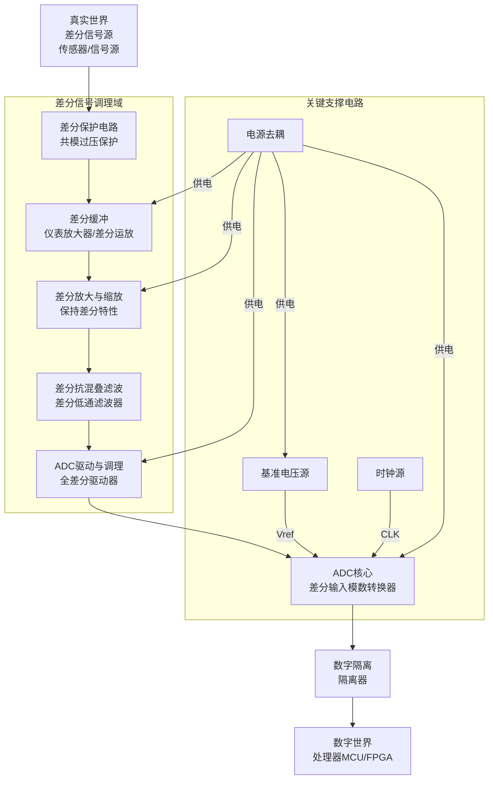

### 单端信号ADC采样

```mermaid
flowchart TD
    A[真实世界<br/>传感器/信号源] --> B[保护与初级调理<br/>过压保护、初步滤波]

    subgraph S1 [模拟信号调理域]
        B --> C[缓冲与阻抗匹配<br/>电压跟随器]
        C --> D[放大与缩放<br/>运算放大器]
        D --> E[抗混叠滤波<br/>RC低通滤波器]
        E --> F[单端转差分<br/>全差分放大器]
        F --> G[ADC驱动<br/>专用驱动器]
    end

    G --> H[ADC核心<br/>模数转换器]
    
    subgraph S2 [关键支撑电路]
        I[基准电压源] -->|Vref| H
        J[时钟源] -->|CLK| H
        K[电源去耦] -->|供电| C
        K -->|供电| D
        K -->|供电| F
        K -->|供电| G
        K -->|供电| H
        K -->|供电| I
    end

    H --> L[数字隔离<br/>隔离器]
    L --> M[数字世界<br/>处理器MCU/FPGA]

```

### 差分信号ADC采样

```mermaid
flowchart TD
    A[真实世界<br/>差分信号源<br/>传感器/信号源] --> B[差分保护电路<br/>共模过压保护]

    subgraph S1 [差分信号调理域]
        B --> C[差分缓冲<br/>仪表放大器/差分运放]
        C --> D[差分放大与缩放<br/>保持差分特性]
        D --> E[差分抗混叠滤波<br/>差分低通滤波器]
        E --> F[ADC驱动与调理<br/>全差分驱动器]
    end

    F --> H[ADC核心<br/>差分输入模数转换器]
    
    subgraph S2 [关键支撑电路]
        I[基准电压源] -->|Vref| H
        J[时钟源] -->|CLK| H
        K[电源去耦] -->|供电| C
        K -->|供电| D
        K -->|供电| F
        K -->|供电| H
        K -->|供电| I
    end

    H --> L[数字隔离<br/>隔离器]
    L --> M[数字世界<br/>处理器MCU/FPGA]
```